- [4. 并发编程基础](#4-并发编程基础)
	- [4.1 线程](#41-线程)
	- [4.2 启动和终止线程](#42-启动和终止线程)
	- [4.3 线程间通信](#43-线程间通信)
	- [4.4 线程应用](#44-线程应用)
- [5. Java中的锁](#5-java中的锁)
	- [5.1 Lock](#51-lock)
	- [5.2 队列同步器AQS](#52-队列同步器aqs)
	- [5.3 重入锁](#53-重入锁)
	- [5.4 读写锁](#54-读写锁)
	- [5.5 LockSupport](#55-locksupport)
	- [5.6 Condition](#56-condition)
- [6. Java并发容器和框架](#6-java并发容器和框架)
	- [6.1 ConcurrentHashMap](#61-concurrenthashmap)
	- [6.2 ConcurrentLinkedQueue](#62-concurrentlinkedqueue)
	- [6.3 BlockingQueue](#63-blockingqueue)
	- [6.4 Fork Join框架](#64-fork-join框架)

# 4. 并发编程基础

### 4.1 线程

程序的正确性不能依赖线程的优先级高低

- 线程的状态
	- obj.wait()方法是将当前线程进行等待状态，并释放obj的锁，所以在此之前必须先获得过obj的锁
	
- Daemon线程
	- 用thread.setDaemon(true)将线程设置为Daemon线程
	- 在Java虚拟机退出时Daemon线程中的finally块并不一定会执行,甚至连Daemon线程的run方法都不一定会执行

### 4.2 启动和终止线程

- 创建线程时，默认当前线程就是创建的新线程的父线程，新线程继承了父线程是否为Daemon、优先级和加载资源的contextClassLoader以及可继承的ThreadLocal
- 创建线程时为线程指定名称，可方便jstack定位问题
- 若线程已经处于终结状态，即使该线程被中断过，在调用该线程对象的isInterrupted()时依旧会返回false
- 方法在抛出InterruptedException之前，Java虚拟机会先将该线程的中断标识位清除，然后抛出InterruptedException，此时调用isInterrupted()方法将会返回false
- 过期的suspend()、resume()和stop()等方法在调用后，线程不会释放已经占有的资源（比如锁），而是占有着资源进入睡眠状态，这样容易引发死锁问题
- 应循环检查中断标志位来安全终止线程

### 4.3 线程间通信

- 每个对象都有自己的监视器，synchronized即获取到的是对象的监视器：			
	
- 一个线程等待另一个线程完成一定操作再继续执行
	- 可以使用轮询某个标志来实现，如			
				
		
		但难以确保及时性或者难以降低开销
	- 使用wait()和notify()实现
		- 使用wait()、notify()和notifyAll()时需要先对调用对象加锁
		- notify()或notifyAll()方法调用后，等待线程依旧不会从wait()返回，需要调用notify()或notifAll()的线程释放锁之后，等待线程才有机会从wait()返回
		- notify()方法将等待队列中的一个等待线程从等待队列中移到同步队列中，被移动的线程从由WAITING变为BLOCKED
		- 从wait()方法返回的前提是获得了调用对象的锁
		
	- 等待/通知经典范式
		- 等待方：											
			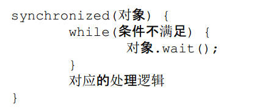
		- 通知方：										
			
- 管道输入/输出流
	- 用于线程之间的数据传输，而传输的媒介为内存
	- 对于Piped类型的流，必须先要进行绑定，也就是调用connect()方法，否则将会抛出异常
- join实现原理							
	 
- ThreadLocal
	- 见博客[https://blog.csdn.net/wuyangyang555/article/details/82774693](https://blog.csdn.net/wuyangyang555/article/details/82774693 "ThreadLocal解析")

### 4.4 线程应用

- 等待超时模式						
	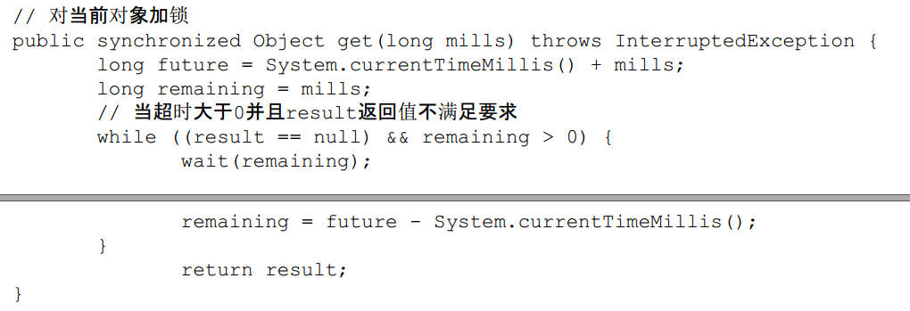 
- 简单的数据库连接池实例（连接池原理）
	- 关键是超时机制（该模式适用于其他资源获取）
- 线程池技术及示例（线程池原理）
	- 预先创建了若干数量的线程，并且不能由用户直接对线程的创建进行控制，在这个前提下**重复使用**固定或较为固定数目的线程来完成任务的执行
		- 消除了频繁创建和消亡线程的系统资源开销
		- 面对过量任务的提交能够平缓的劣化				
		 
		
		线程池的本质就是使用了一个线程安全的工作队列连接工作者线程和客户端线程，客户端线程将任务放入工作队列后便返回，而**工作者线程则不断地从工作队列上取出工作并执行**

# 5. Java中的锁

### 5.1 Lock
将释放锁的语句写在finally块中，不将获取锁的语句写在try块中。保证锁一定被释放，且不会导致锁无故释放
	

synchronized没有的特性：
- 能非阻塞的获取锁
- 能被中断地获取锁
- 超时获取锁

### 5.2 队列同步器AQS
AQS基于模板模式

- 接口与示例
	- 访问和修改状态
		- getState()：获取当前同步状态
		- setState(int newState)：设置当前同步状态
		- compareAndSetState(int expect,int update)：CAS设置当前状态，保证原子性
	- 提供的模板方法，三大类
		- 独占式获取与释放同步状态
		- 共享式获取与释放同步状态
		- 查询同步队列中的等待线程情况
	- 独占锁的实现示例						
		 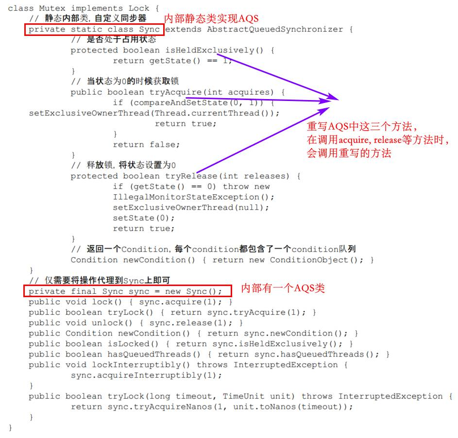
- AQS实现原理
	- 线程获取同步状态失败时，同步器会将当前线程以及等待状态等信息构造成为一个节点（Node）并将其加入同步队列，同时会阻塞当前线程，当同步状态释放时，会把首节点中的线程唤醒，使其再次尝试获取同步状态
	- 同步器将节点加入到同步队列：						
		
	- 首节点是获取同步状态成功的节点，首节点的线程在释放同步状态时，将会唤醒后继节点，而后继节点将会在获取同步状态成功时将自己设置为首节点：		
		
	- 独占锁同步器的acquire方法：						
		
		
		总体流程如下：
		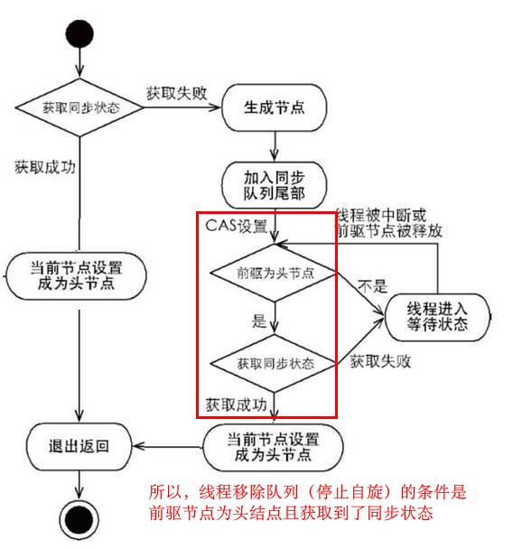
	- 独占锁同步器的release方法：					
		
	- 共享锁不同之处就是同步状态上限不为1，可以有多个线程同时获取与释放，故获取与释放时都需要CAS操作
	- 带超时机制的独占锁的acquire内方法：					
		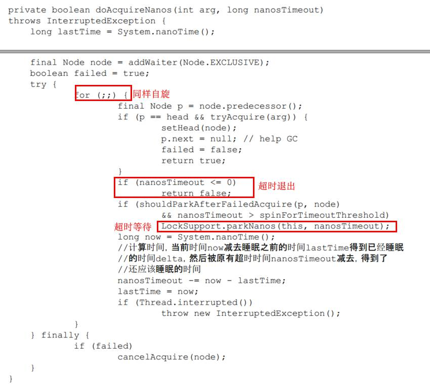
	- 自定义同步锁示例（只允许两个线程同时访问）：						
		

### 5.3 重入锁

- 重入实现原理：					
	 

公平性锁保证了锁的获取按照FIFO原则，而代价是进行大量的线程切换。非公平性锁虽然可能造成线程“饥饿”，但极少的线程切换，保证了其更大的吞吐量

### 5.4 读写锁

- 读写状态设计								
	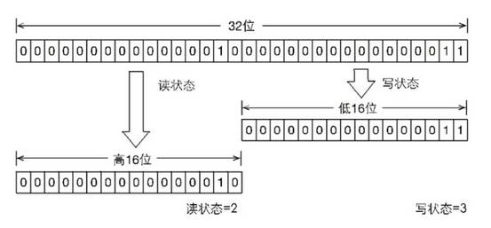
	用一个整型的高16位表示读状态，低16位表示写状态 
- 写锁主要实现：					
	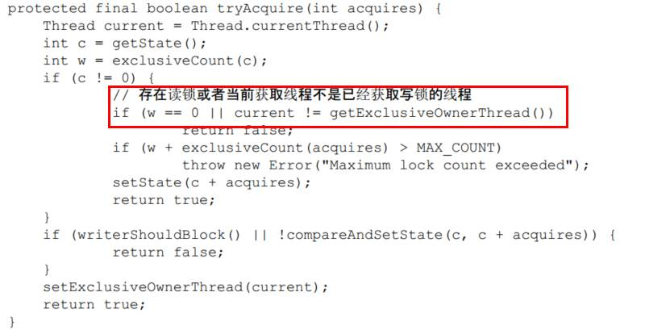
- 读锁主要实现：						
	
- 锁降级
	- 先获取写锁，再获取读锁（防止写锁释放之后，其它线程对数据进行写操作），再释放写锁的过程

### 5.5 LockSupport

- park: 使线程进入等待状态
- parkNanos: 带超时参数
- parkUntil: 带超时参数（直到某个时刻）
- unpark: 唤醒线程

### 5.6 Condition

- 与object中的监视器方法的对比：
	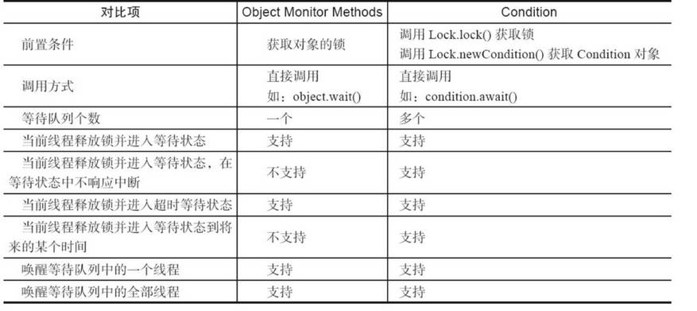

- synchronized相当于lock.lock(), object.wait()相当于condition.await():
	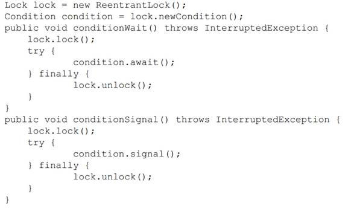

Condition实现原理：
- Condition是AQS的内部实现类
- 相当于AQS中有一个同步队列（相当于锁池），有很多个等待队列（相当于等待池，new了几个condition就有几个等待池，这点与object内的方法不同）
	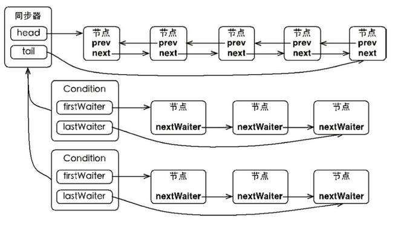
- Condition调用await()方法原理：					
	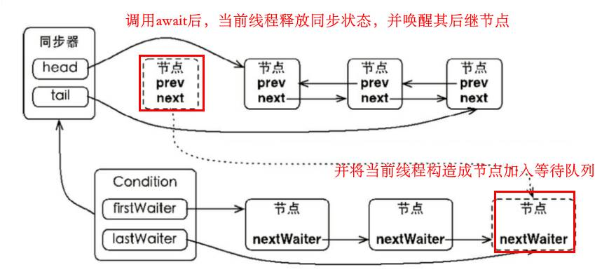
- Condition调用signal()方法原理：						
	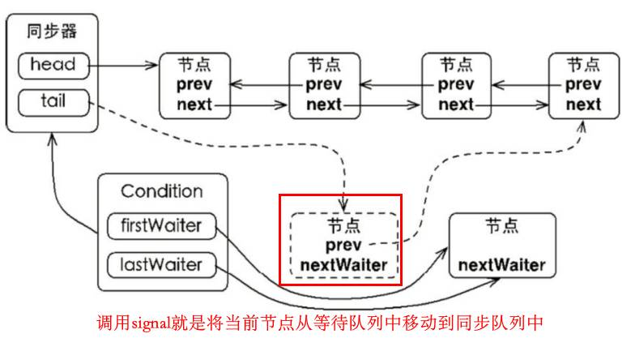
	同理，signalAll()方法就是将等待队列中的**全部节点**都移动到同步队列中，并**唤醒**所有移动节点的线程

# 6. Java并发容器和框架

### 6.1 ConcurrentHashMap
不太全面

### 6.2 ConcurrentLinkedQueue
不太全面

### 6.3 BlockingQueue

- 阻塞队列的插入和移除四套处理方法：							
	
- 各种阻塞队列：									
	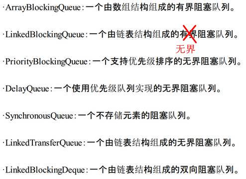
- 阻塞队列实现原理：				
	- 等待通知模式：					
		

### 6.4 Fork Join框架
类似map/reduce，fork分割任务，join合并各子任务的结果

- 工作窃取算法
	- 每个线程一个双端队列，线程做完自己的任务，就去其它线程的队列中取出任务继续执行
	- 窃取线程从尾部拿任务，被窃取线程从头部拿任务，可减少两者的竞争
- ForkJoinTask两个子类
	- RecursiveAction：用于没有返回结果的任务
	- RecursiveTask：用于有返回结果的任务
	- ForkJoinTask需要通过ForkJoinPool来执行
- 一个计算1+2+3+4的实例：					
	
- 可使用isCompletedAbnormally()在主线程中捕获子线程的异常
- 原理：
	- ForkJoinPool由ForkJoinTask数组和ForkJoinWorkerThread数组组成，ForkJoinTask数组负责将存放程序提交给ForkJoinPool的任务，而ForkJoinWorkerThread数组负责执行这些任务
	- fork
		- 调用ForkJoinTask的fork方法时，程序会调用ForkJoinWorkerThread的pushTask方法异步地执行这个任务，然后立即返回结果
		- pushTask方法把当前任务存放在ForkJoinTask数组队列里。然后再调用ForkJoinPool的signalWork()方法唤醒或创建一个工作线程来执行任务
	- join
		- 阻塞当前线程并等待获取结果
		- 细节见书
