# 7. Java中的13个原子操作类
Atomic包里的类基本都是使用Unsafe实现的包装类

### 7.1 原子更新基本类型类

AtomicBoolean/AtomicInteger/AtomicLong:
- getAndIncrement操作（先get后自增，返回get的值）原理：					
	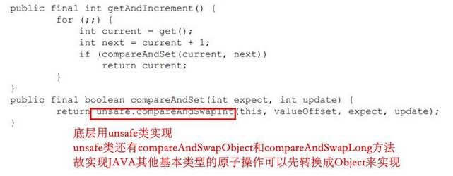

### 7.2 原子更新数组

AtomicIntegerArray/AtomicLongArray/AtomicReferenceArray等，线程安全地对数组中的某一个元素进行更新操作：			
	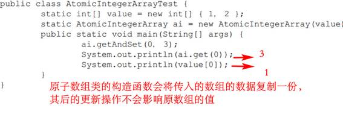

### 7.3 原子更新引用类型
同理，保证的是引用类型的更新操作的线程安全性

### 7.4 原子更新字段类
保证更新类中的字段的线程安全性：						
	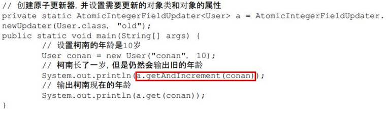

# 8. Java中的并发工具类

CountDownLatch/CyclicBarrier/Semaphore/Exchanger的使用

- 构造函数CyclicBarrier(int parties，Runnable barrierAction)，用于在线程都到达屏障时，优先执行barrierAction任务
- CyclicBarrier和CountDownLatch的区别
	- CountDownLatch的计数器只能使用一次，而CyclicBarrier的计数器可以使用reset()方法重置。所以CyclicBarrier能处理更为复杂的业务场景
	- CyclicBarrier的getNumberWaiting方法可以获得Cyclic-Barrier阻塞的线程数量。isBroken()方法用来了解阻塞的线程是否被中断
- Exchanger只用于两个线程的数据交换

# 9. Java线程池

- **降低资源消耗。**通过重复利用已创建的线程降低线程创建和销毁造成的消耗
- **提高响应速度。**当任务到达时，任务可以不需要等到线程创建就能立即执行
- **提高线程的可管理性。**线程是稀缺资源，如果无限制地创建，不仅会消耗系统资源，还会降低系统的稳定性，使用线程池可以进行统一分配、调优和监控

### 9.1 线程池的实现原理
	
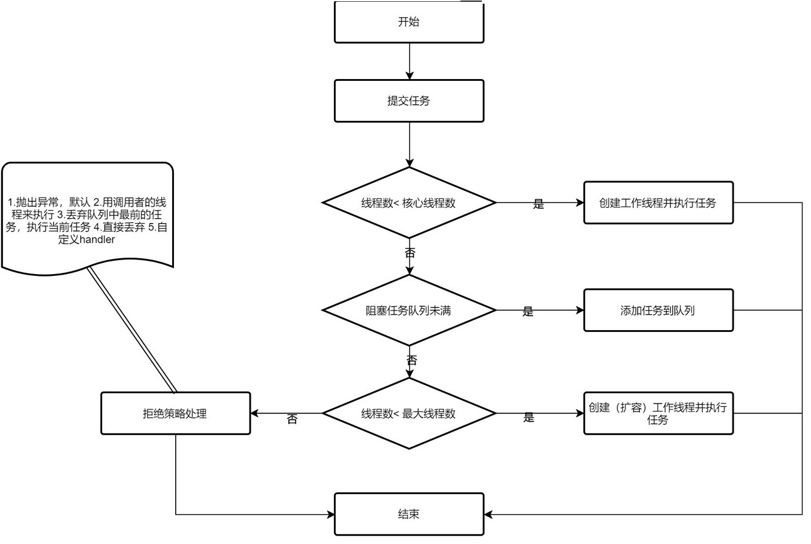

创建新的工作线程需要获取到全局锁，可扩展的设计思路就是为了避免获取全局锁：在工作线程数达到核心线程数时，几乎所有的execute()方法调用都是只加入任务队列，不需要获取全局锁

- 工作线程：线程池创建线程时，会将线程封装成工作线程Worker，Worker在执行完任务后，还会循环获取工作队列里的任务来执行

### 9.2 线程池的使用

- 构造函数参数中的ThreadFactory：用于设置创建线程的工厂，可以通过线程工厂给每个创建出来的线程设置更有意义的名字。使用开源框架guava提供的ThreadFactoryBuilder可以快速给线程池里的线程设置有意义的名字
- 构造函数参数中的keepAliveTime：线程池的工作线程空闲后，保持存活的时间
- execute()方法用于提交不需要返回值的任务，submit()方法用于提交需要返回值的任务
- shutdown和shutdownNow方法
	- 原理是遍历线程池中的工作线程，然后逐个调用线程的interrupt方法来中断线程，所以无法响应中断的任务可能永远无法终止
	- shutdownNow首先将线程池的状态设置成STOP，然后尝试停止所有的**正在执行或暂停任务**的线程，并返回等待执行任务的列表
	- shutdown只是将线程池的状态设置成SHUTDOWN状态，然后中断所有**没有正在执行任务**的线程
	- isShutdown方法都会返回true
	- 当所有的任务都已关闭后，才表示线程池关闭成功，这时调用isTerminaed方法才返回true
- 配置线程池参考规则：
	- 任务性质：
		- CPU密集型任务应配置尽可能小的线程，如配置Ncpu+1个线程的线程池。由于IO密集型任务线程并不是一直在执行任务，则应配置尽可能多的线程，如2*Ncpu
	- 优先级：
		- 优先级不同的任务可以使用优先级队列PriorityBlockingQueue来处理
	- 执行时间：
		- 执行时间不同的任务可以交给不同规模的线程池来处理，或者可以使用优先级队列，让执行时间短的任务先执行
	- 建议使用有界的阻塞队列，否则若任务很多的时候，队列无限制的增长，可能会撑爆内存

# 10. Executor框架

### 10.1 Executor框架简介

框架总体架构如下：								
	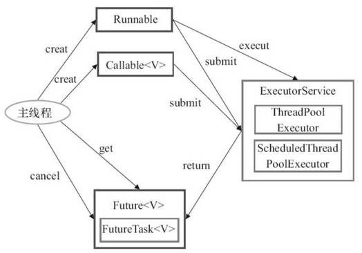

执行结构图如下：								
	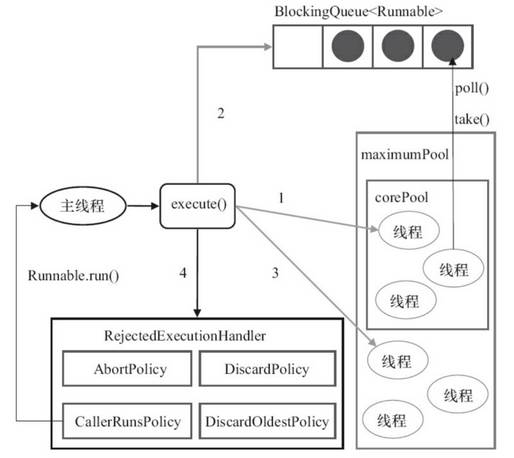

### 10.2 ThreadPoolExecutor详解

- 四个组件：
	- corePool：核心线程池的大小
	- maximumPool：最大线程池的大小
	- BlockingQueue：用来暂时保存任务的工作队列
	- RejectedExecutionHandler：当ThreadPoolExecutor已经**关闭**或ThreadPoolExecutor已经**饱和**时，execute()方法将要调用的Handler
- FixedThreadPool详解：									
	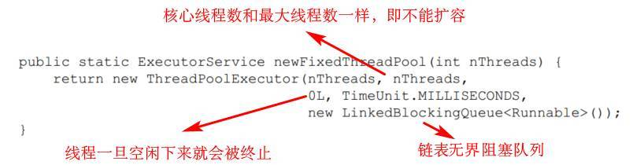
	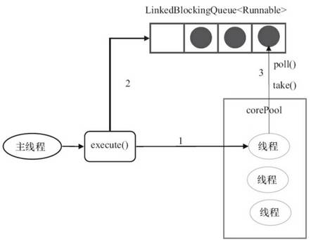
	- 特性：
		- maximumPool参数无效
		- 无界队列，未执行方法shutdown()的线程池不会拒绝任务
- SingleThreadExecutor详解：							
	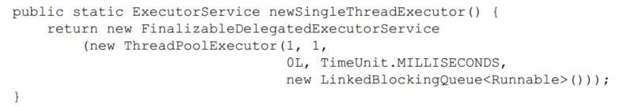
	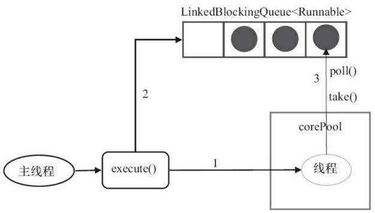
	- 特性：
		- 其实是串行执行
		- 无界队列，未执行方法shutdown()的线程池不会拒绝任务
- CachedThreadPool详解：							
	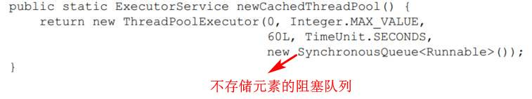
	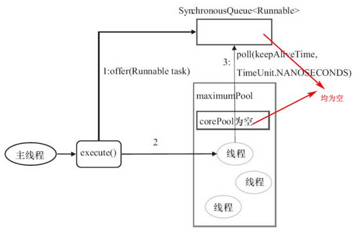
	- 特性：
		- 主线程提交任务的速度高于maximumPool中线程处理任务的速度时，CachedThreadPool会不断创建新线程。极端情况下，CachedThreadPool会因为创建过多线程而耗尽CPU和内存资源
		- SynchronousQueue是一个没有容量的阻塞队列。每个插入操作必须等待另一个线程的对应移除操作，反之亦然。看似空闲线程和主线程在通过该队列来进行通信，其实可看成是主线程直接把任务给了空闲线程					
		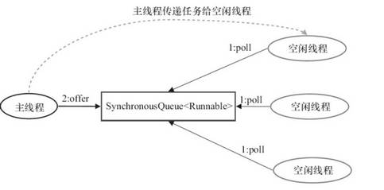

### 10.3 ScheduledThreadPoolExecutor详解

继承ThreadPoolExecutor，给定的延迟之后运行任务，或者定期执行任务。功能与Timer类似，但更强大、更灵活

- 运行机制									
	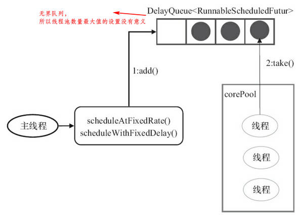
- 实现
	- 会把待调度的任务ScheduledFutureTask放到DelayQueue中，ScheduledFutureTask包含：
		- 成员变量time，表示这个任务将要被执行的时刻
		- 成员变量sequenceNumber，表示这个任务的序号
		- 成员变量period，表示任务执行的间隔周期
	- DelayQueue封装了一个PriorityQueue，time小的排在前面（时间早的任务将被先执行），time相同时，sequenceNumber小的排在前面（先提交的任务将被先执行）						
	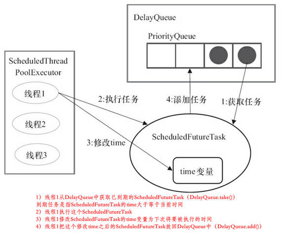
- 示例（多个线程轮流周期执行任务）：
	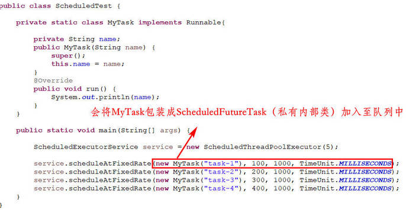

### 10.4 FutureTask详解
Future接口和实现Future接口的FutureTask类，代表异步计算的结果

