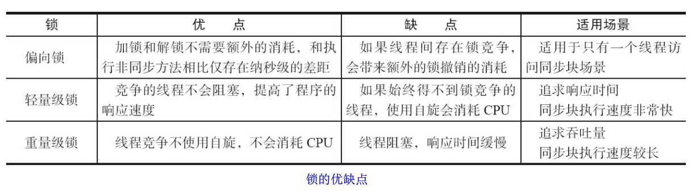
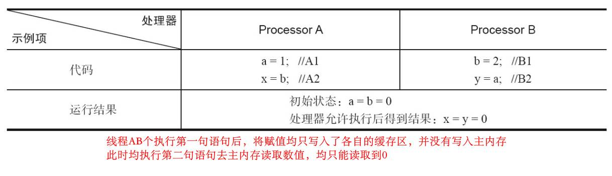
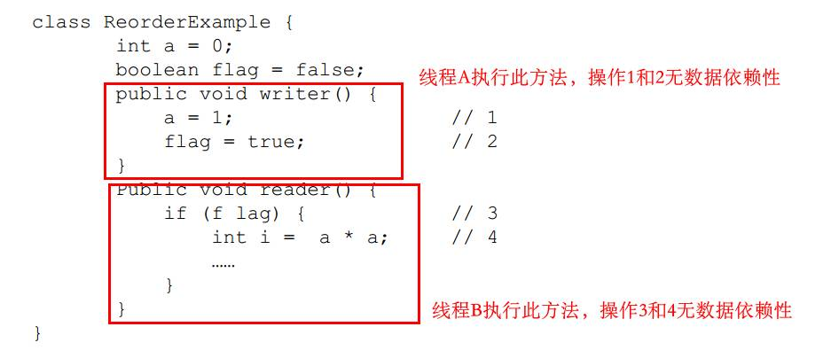
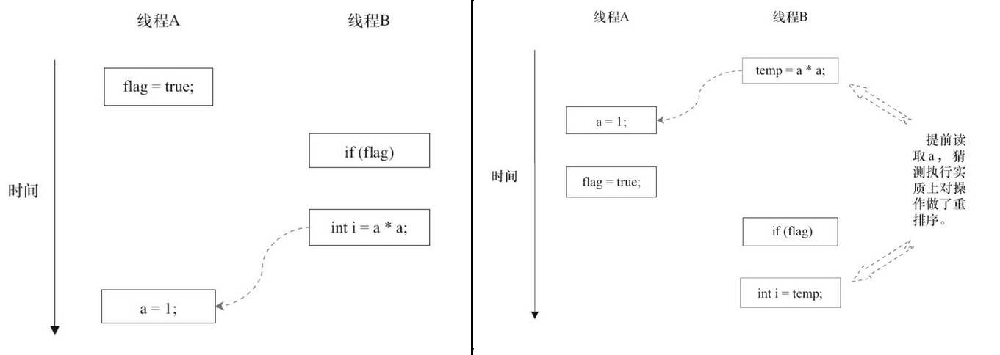
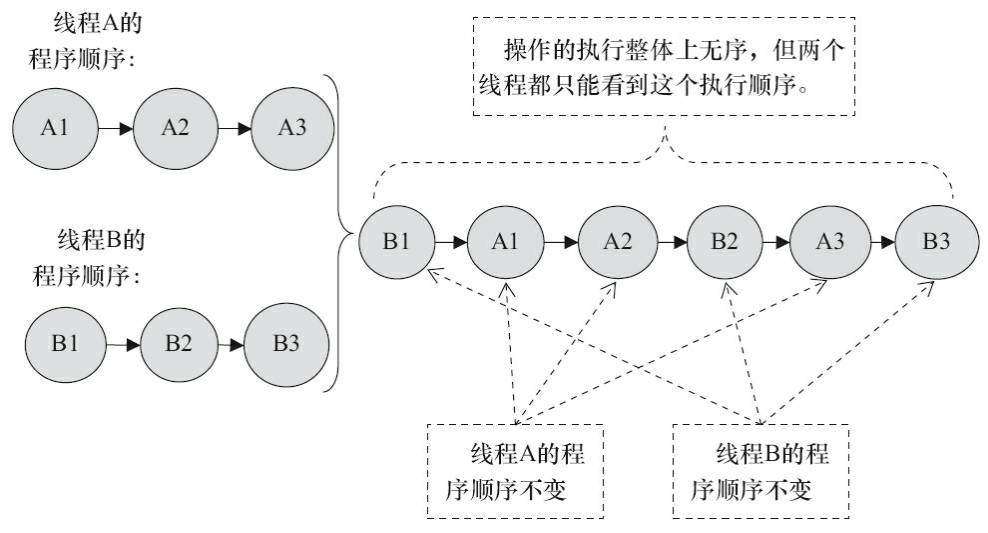
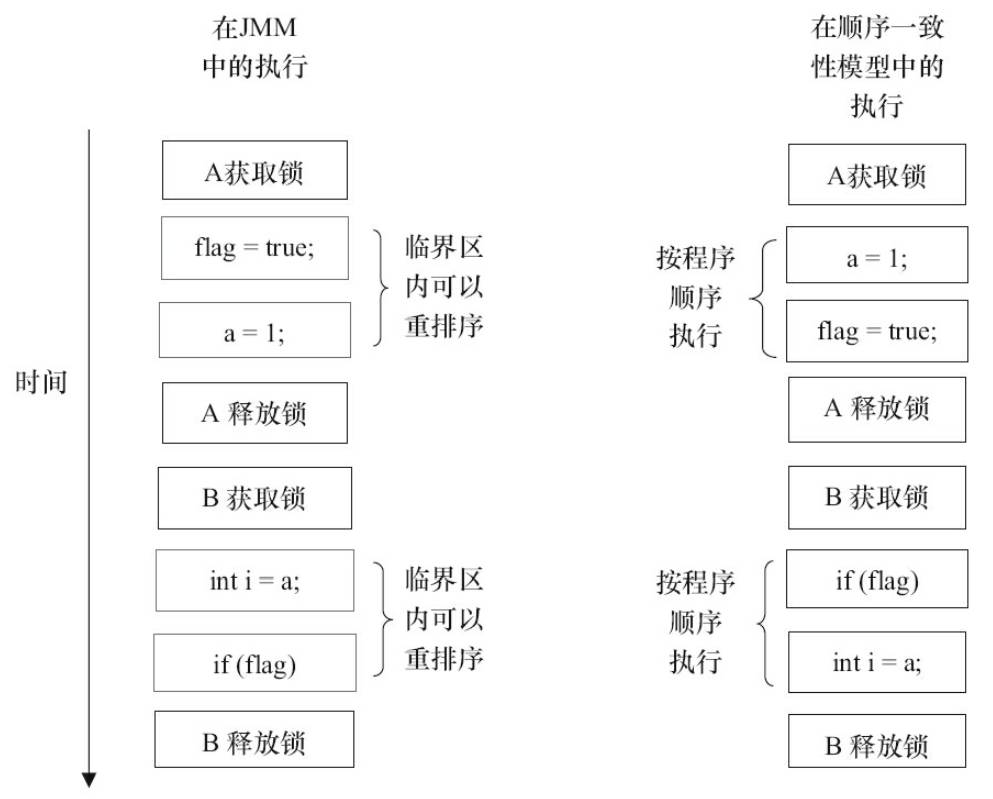
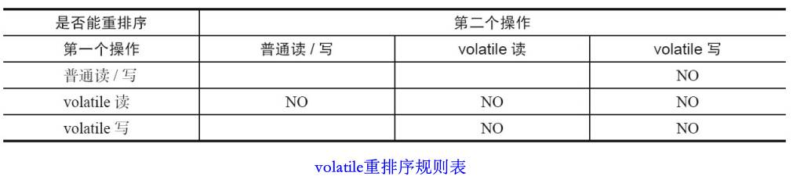
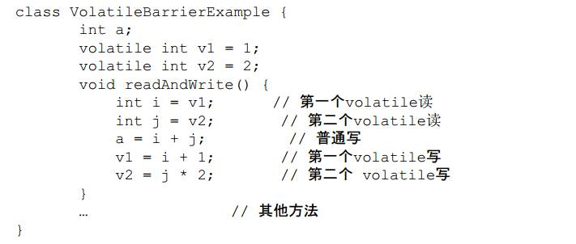
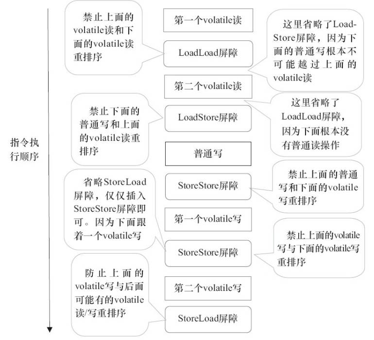
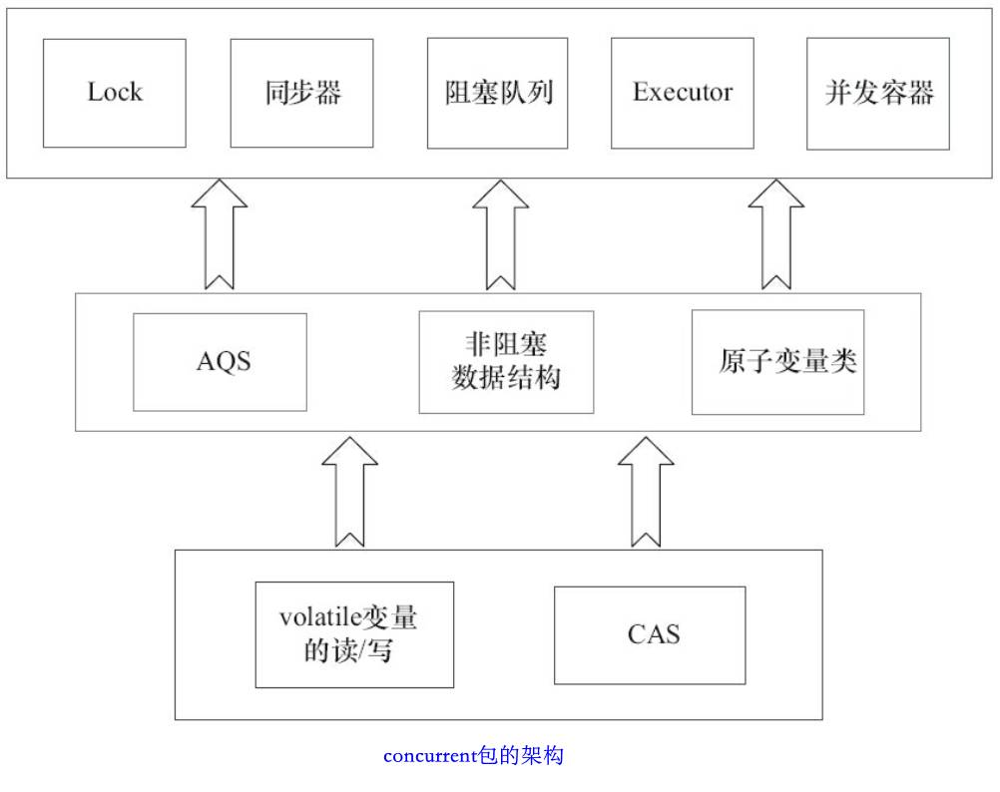

# 1. 并发编程的挑战

### 1.1 上下文切换

vmstat可看线程上下文切换的次数

- 减少上下文切换的次数
	- 无锁并发编程：竞争锁时，会引起上下文切换；将数据的ID按照Hash算法取模分段，不同的线程处理不同段的数据
	- CAS：不需要加锁
	- 使用尽量少的线程（除去大量waiting状态的线程）
	- 协程：单线程里多任务的调度和切换

### 1.2 死锁

互相等待对方释放锁

- 避免死锁
	- 避免一个线程同时获取多个锁
	- 避免一个线程在锁内同时占用多个资源
	- 定时锁
	- 数据库锁，加锁和解锁必须在同一连接中，否则解锁失败

### 1.3 资源限制

如**线程的数量比数据库连接数大很多**

硬件资源（CPU等）用集群解决，软件资源（socket，数据库连接数等）用连接池连接复用解决

# 2. Java并发机制的底层原理

### 2.1 volatile

volatile保证可见性，不会引起线程上下文的切换

实现原则：
- Lock前缀指令会引起处理器缓存（相当于线程本地内存）回写到主内存
- 一个处理器的缓存回写到主内存会导致其他处理器的缓存无效

### 2.2 synchronized

monitorenter指令是在编译后插入到同步代码块的开始位置，而monitorexit是插入到方法结束处和异常处，JVM要保证每个monitorenter必须有对应的monitorexit与之配对。任何对象都有
一个monitor与之关联，当且一个monitor被持有后，它将处于锁定状态。线程执行到monitorenter指令时，将会尝试获取对象所对应的monitor的所有权，即尝试获得对象的锁

- Java对象头
	- 对象头中mark word的存储结构及状态变化：				
		
		
- 偏向锁
	- 使用了一种等到竞争出现才释放锁的机制，所以当其他线程尝试竞争偏向锁时，持有偏向锁的线程才会释放锁（全局安全点）
- 轻量级锁
	- 将对象头中的Mark Word复制到锁记录，尝试使用CAS将对象头中的Mark Word替换为指向锁记录的指针。如果成功，当前线程获得锁，如果失败，表示其他线程竞争锁，当前线程便尝试使用**自旋**来获取锁
- 不同锁的优缺点								
	

### 2.3 原子操作的实现原理

- 处理器实现原子操作
	- 总线锁保证原子性
	- 缓存锁保证原子性
- java实现原子操作
	- 循环CAS（自旋CAS）
		- ABA问题，加版本号来解决此问题
		- 循环时间长，开销大
		- 只能保证一个共享变量的原子操作
	- 锁机制实现原子操作
		- 除了偏向锁，都用到了循环CAS操作来实现锁

# 3. Java内存模型

### 3.1 内存模型的基础

并发编程的两个关键问题：
- 线程之间的通信
	- 共享内存和消息传递，java采用的是共享内存模型，共享内存模型的通信是隐式的 
- 线程之间的同步
	- 共享内存模型的同步是显示的 

jmm抽象结构：
- 实例域、静态域和数组元素等堆中的内存可视为共享内存
- 每个线程都有一个私有的本地内存，并不真实存在，只是一个抽象概念，涵盖了缓存、写缓冲区等

从源码到最终执行的指令序列经历的重排序：				

- JMM的编译器重排序规则会禁止特定类型的编译器重排序（1）
- 插入特定类型的**内存屏障**指令禁止特定类型的处理器重排序（2和3）
- 通过禁止重排序来保证可见性

重排（内存系统重排序）举例：

### 3.2 重排序

- 数据依赖性
	- 两个操作访问同一个变量，其中若有一个操作为写操作，它们就具有数据依赖性
	- 数据依赖性的两个操作的执行顺序只要改变了，程序的结果就会发生变化
	- 处理器和编译器会保证单线程中的数据依赖性不被破坏，但不能保证多线程的数据依赖性
- as-if-serial语义
	- 不管怎么重排序，**单线程**程序的执行结果不能被改变 
	- 所以，编译器和处理器不会对存在数据依赖关系的操作做重排序
- 重排序对多线程的影响举例						
		
	
	- 可看出，多线程中重排序可能会对程序结果造成影响

### 3.3 顺序一致性模型
- JMM不是这种模型
- 即指令不被重排序的模型
- 相比重排序的模型，未同步的程序依然会得出错误的结果
	
- 而同步的程序，即使有重排序，结果也是正确的
	
- 未同步程序的两种模型的差异：
	- 顺序一致性模型保证单线程内的操作会按程序的顺序执行，而JMM不保证单线程内的操作会按程序的顺序执行
	- 顺序一致性模型保证所有线程只能看到一致的操作执行顺序，而JMM不保证所有线程能看到一致的操作执行顺序
	- JMM不保证对64位的long型和double型变量的写操作具有原子性，而顺序一致性模型保证对所有的内存读/写操作都具有原子性（JVM在这种处理器上运行时，可能会把一个64位long/double型变量的写操作拆分为两个32位的写操作来执行。这两个32位的写操作可能会被分配到不同的总线事务中执行，此时对这个64位变量的写操作将不具有原子性）

### 3.4 volatile内存语义

一个volatile变量的单个读/写操作，等效于，一个普通变量的读/写操作使用同一个锁来同步

- 可见性：对一个volatile变量的读，总是能看到（任意线程）对这个volatile变量最后的写入
- 原子性：对任意单个volatile变量的读/写具有原子性（包括64位的double和long），但类似于volatile++这种复合操作不具有原子性

volatile重排序规则表：

实现：在指令序列中**插入内存屏障**来禁止特定类型的处理器重排序，如：		

和锁的区别：
- volatile仅仅保证对单个volatile变量的读/写具有原子性，而锁的互斥执行的特性可以确保对整个临界区代码的执行具有原子性
- 在功能上，锁比volatile更强大；在可伸缩性和执行性能上，volatile更有优势

### 3.5 锁的内存语义

锁的释放和获取都会保证可见性，即刷新主内存

AQS（ReentrantLock）原理

concurrent包的通用实现模式：
- 声明共享变量为volatile
- 使用CAS的原子条件更新来实现线程之间的同步
- 配合以volatile的读/写和CAS所具有的volatile读和写的内存语义来实现线程之间的通信
- concurrent包架构如图：
	

### 3.6 final域的内存语义
