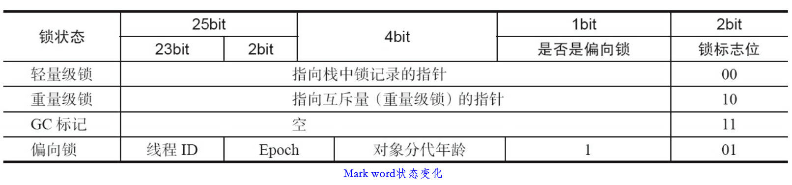

# 1. 并发编程的挑战

### 1.1 上下文切换

vmstat可看线程上下文切换的次数

- 减少上下文切换的次数
	- 无锁并发编程：竞争锁时，会引起上下文切换；将数据的ID按照Hash算法取模分段，不同的线程处理不同段的数据
	- CAS：不需要加锁
	- 使用尽量少的线程（除去大量waiting状态的线程）
	- 协程：单线程里多任务的调度和切换

### 1.2 死锁

互相等待对方释放锁

- 避免死锁
	- 避免一个线程同时获取多个锁
	- 避免一个线程在锁内同时占用多个资源
	- 定时锁
	- 数据库锁，加锁和解锁必须在同一连接中，否则解锁失败

### 1.3 资源限制

如**线程的数量比数据库连接数大很多**

硬件资源（CPU等）用集群解决，软件资源（socket，数据库连接数等）用连接池连接复用解决

# 2. Java并发机制的底层原理

### 2.1 volatile

volatile保证可见性，不会引起线程上下文的切换

实现原则：
- Lock前缀指令会引起处理器缓存（相当于线程本地内存）回写到主内存
- 一个处理器的缓存回写到主内存会导致其他处理器的缓存无效

### 2.2 synchronized

monitorenter指令是在编译后插入到同步代码块的开始位置，而monitorexit是插入到方法结束处和异常处，JVM要保证每个monitorenter必须有对应的monitorexit与之配对。任何对象都有
一个monitor与之关联，当且一个monitor被持有后，它将处于锁定状态。线程执行到monitorenter指令时，将会尝试获取对象所对应的monitor的所有权，即尝试获得对象的锁

- Java对象头
	- 对象头中mark word的存储结构及状态变化：				
		
		