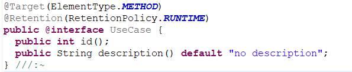
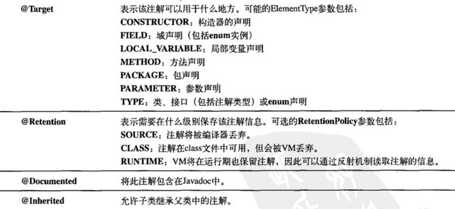
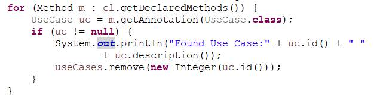

# 16. 数组
### 16.1 数组特殊性

与容器的区别主要有三方面：效率、类型和保存基本类型的能力
- 效率最高，但大小被固定
- 能直接用基本类型，容器需要包装类

### 16.2 数组是第一级对象
数组是一个对象，在堆中也是同对象一样分配了内存，保存的内容是其它对象的引用或者基本类型的值

多维数组的各维内数组的长度可以不一致，称为**粗糙数组**
### 16.5 数组与泛型

不能：
	
	Class<T>[] arr = new Class<T>[10];

(可以声明`Class<T>[] arr;`这么一个引用，不实例化)

但是可以：

	class MyClass<T>{
		private T[] = ...;
	}
### 16.6 创建测试数据

- Arrays.fill(). 只能用单一的数值来填充数组
- Generator数据生成器

(......重要，新知识，篇幅大)

### 16.7 Arrays实用功能

Arrays的一些static方法：
equals(), fill(), sort(), binarySearch()（用于在已排序的数组中查找元素）, toString(), hashCode(), asList() 

- 复制数组。 System.arraycopy()方法，不会自动装包拆包，在复制对象时是浅复制（即只复制引用）

# 18. Java I/O系统
###18.1 File类
**目录列表器**：获取目录下的文件列表  
`File f= new File("yourpath")`  
`String[] list = f.list([new FilenameFilter()])`  

**目录实用工具**：查找、遍历目录等方法  

File类还可以创建目录、创建文件、查看文件信息等文件操作  

###18.2 输入和输出
**InputStream类型**PDF567  
**OutputStream类型**PDF568  

**FilterInputStream类型**PDF569  
**FilterOutputStream类型**PDF570  
(面向字节的)

###18.4 Reader和Writer
提供兼容Unicode和面向字符的I/O，为了国际化考虑  

各类Reader和Writer PDF571  

RandomAccessFile类

###18.6 I/O流的典型使用方式
**缓冲输入文件**：  
`BufferedReader in = new BufferedReader(new FileReader("filename"));`  
`while((str = in.readline())!= null)`  
`in.close()`  

**从内存输入**  
**格式化的内存输入**  

**基本的文件输出**：  
`PrintWriter out = new PrintWriter(new BufferedWriter(new FileWriter("filename")));`  
`out.println("...");`  
`out.close();`  

**存储和恢复数据（跨平台，面向字节）**：  
`DataOutputStream out = new DataOutputStream(new BufferedOutputStream(new FileOutputStream("filename")));`  
`out.write...();`  
`out.close();`  

### 18.7 （.............）

（...........）

#19. 枚举 

（.........）

# 20. 注解
### 20.1 基本语法
定义注解和定义接口类似，在关键字interface前加@，且一样会被编译成class文件
 
不包含元素（定义与方法类似）的注解是标记注解  

三种标准注解：`@Override, @Deprecated, @SuppressWarnings`  
四种元注解：`@Target, @Retention, @Documented, @Inherited` 

### 20.2 注解处理器

- 注解元素可用类型
	- 基本类型
	- String
	- Class
	- enum
	- Annotation
	- 以上的数组
- 默认值
	- 元素一定要有值，要么是默认值，要么在使用时传入
	- 不能以null作为元素值
- 注解本身不支持继承

### 20.3 apt工具

(....)略

### 20.4 观察者模式用于apt

(....)略

### 20.5 单元测试注解

(....)略
