[TOC]

# 10. Spring 的 JDBC

### 10.1 Spring的数据访问哲学 

即DAO，Spring里也叫Repository：

- 使得服务易于测试，如mock实现
- 与应用解耦

Spring对数据访问提供了统一的异常体系：

- 传统的JDBC几乎每一步都需要抛出SQLException：
  - 应用程序无法连接数据库
  - 要执行的查询存在语法错误
  - 查询中所使用的表和/或列不存在
  - 试图插入或更新的数据违反了数据库约束 
- SQLException的问题通常无法在catch中解决
- JDBC异常过于简单，Spring JDBC提供的异常很完善，几乎为为读取和写入数据库的所有错误都提供了异常 ，并且并没有与特定的持久化方式相关联 
- Spring JDBC认为大部分异常不能在catch里修复，所以都设置为非检查异常，开发人员可选择捕获或不捕获

数据访问模板化：

- 固定和可变的部分分别为：模板和回调

  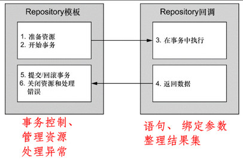

- Spring不止JDBCTemplate，几乎所有持久化框架都有

### 10.2 配置数据源

- 使用JNDI数据源（数据源完全可以在应用程序之外进行管理 ）

  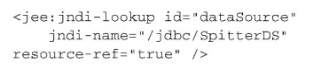

- 使用数据源连接池 （在Spring中配置和管理数据源）

  - 常用的数据源连接池

    - DBCP 

      

    - c3p0

    - BoneCP

- JDBC驱动的数据源 （均没有池化管理，线上不推荐使用）

  - 最简单的配置方式

  - DriverManagerDataSource：在每个连接请求时都会返回一个新建的连接 

    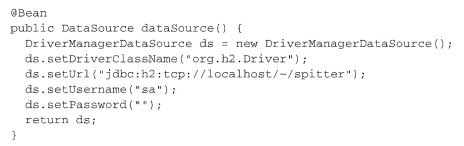

  - SimpleDriverDataSource 

  - SingleConnectionDataSource ：单例连接

- 嵌入式的数据源（多用于测试）

- 使用profile选择数据源 

  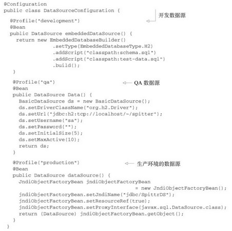

### 10.3 在Spring中使用JDBC 

- JdbcTemplate 

  - 支持简单的JDBC数据库访问功能以及基于索引参数的查询 

  - 基于索引的参数需要留意参数的顺序

    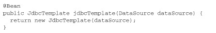

    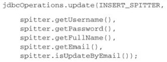

    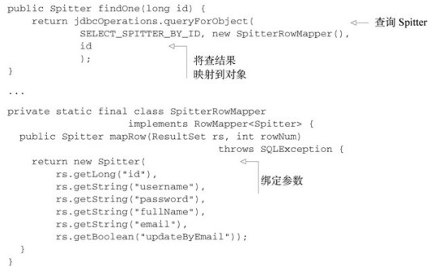

- NamedParameterJdbcTemplate 

  - 可以将值以命名参数的形式绑定到SQL中 

    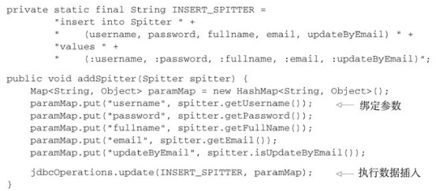

# 11. 关系映射持久化数据

### 11.1 Spring集成Hibernate

略过，不用Hibernate

### 11.2 Spring与JPA

略，JPA过时

### 11.3 借助Spring Data实现自动化的JPA Repository 

# 12. 使用NoSQL数据库

### 12.1 组合MongoDB

### 12.2 组合Neo4j

### 12.3 组合Redis

- 连接

  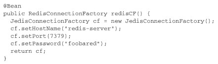

- 原始使用方式

  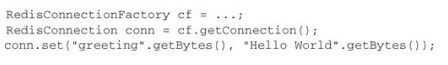

- RedisTemplate 和 StringRedisTemplate 

  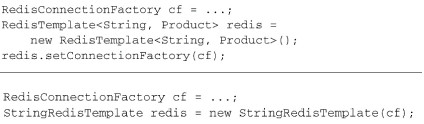

  - 可直接操作简单值、list、set、Zset、hash
  - API见书

- key和value的序列化器 

  - 某个条目保存到Redis key-value存储的时候， key和value都会使用Redis的序列化器 

    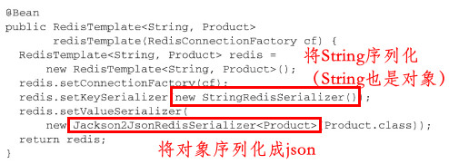

# 13. 缓存数据 

先跳过

# 14. 保护方法应用 

Spring Security保护bean方法