[TOC]

# 5. 构建Spring Web应用程序

### 5.1 Spring MVC

- 请求过程

  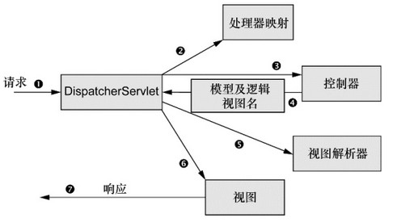

  - DispatcherServlet 是Spring MVC的前端控制器
  - handler mapping 负责将请求分派给各个控制器
  - 控制器处理完成后，获取到一些信息（模型），不能直接返回给用户，需要将模型和逻辑视图名发送给DispatcherServlet 进行进一步处理

- 配置DispatcherServlet ：
  
  - 可在web.xml文件中进行Servlet配置

  - 也可通过扩展AbstractAnnotationConfigDispatcherServletInitializer类来进行配置（同时创建DispatcherServlet 和ContextLoaderListener ，分别对应两个不同的应用上下文）

    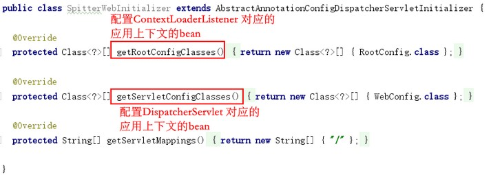

- 启用MVC
  - 可在XML中使用`<mvc:annotationdriven>`启用注解驱动的Spring MVC
  - 可创建一个带有`@EnableWebMvc`注解的配置类 
    - 需要视图解析器ViewResolver 的bean
    - 需要启动`@ComponentScan`扫描`@Controller`
    - 转发静态资源请求到DefaultServlet

### 5.2 基本的控制器

- `@Controller` 和`@RequestMapping` 注解

- `mockMvc`类可对控制器进行测试

- Model（map类型）作为Controller方法的参数，在方法内将数据添加到模型中，而后连同返回的逻辑视图名一起交给前端控制器处理

  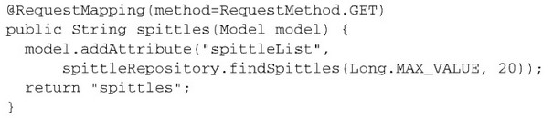

  - 当没有Model参数，或者没有返回逻辑视图名，而是直接返回结果时，会自动进行匹配，将结果加入至模型并自动寻找与访问路径名称相同的视图文件

### 5.3 处理请求参数

- 查询参数：`path?param=value`, `@RequestParam`注解
- 路径参数：`path/value`，`@PathVariable` 注解结合`@RequestMapping`的value占位符

### 5.4 处理表单数据

- 接收对象参数，与请求中同名的参数进行对应
- 可使用校验注解来限制对象域，如`@NotNull，@Size`等注解，结合`@Valid`注解标记对象参数 ，再结合Error类参数来进行逻辑控制

# 6. 渲染Web视图

### 6.1 视图解析

将控制器中请求处理的逻辑和视图中的渲染实现解耦是Spring MVC的一个重要特性，视图解析器通过逻辑视图名找到具体的视图

解析原理：

- ViewResolver 接口，其中resolveViewName() 方法接收一个视图名和一个Locale对象 ，返回一个View对象（即处理逻辑视图名，找到实际的视图）
- View接口render()方法接收Model参数和request、response参数（即得到视图后，通过Model和request中的数据，将结果渲染出来写入到response）
- 视图解析器在原理上，就是编写ViewResolver 和View的实现，将渲染的内容放到response中 
- Spring MVC内置了多种常用视图解析器的实现

### 6.2 JSP视图

- InternalResourceViewResolver 

  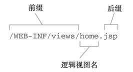

  - 将其配置成bean并设置前后缀即可使用，会将逻辑视图名解析为InternalResourceView实例 （对应JSP文件） 
  - InternalResourceViewResolver 解析JSTL视图 (.........略)

- Spring的JSP标签库（简化JSP的编写），各种标签详细见书 `<%@ taglib uri="http://www.springframework.org/tags/form" prefix="sf" %>`

- Spring通用的标签库，各种标签详细见书`<%@ taglib uri="http://www.springframework.org/tags" prefix="s" %>`

### 6.3 Apache Tiles视图定义布局 

布局引擎，定义适用于所有页面的通用页面布局 

### 6.4 Thymeleaf 

见书，略

# 7. Spring MVC的高级技术 

### 7.1 Spring MVC配置方案

- 自定义DispatcherServlet配置 

  - Java配置的方案中，重写AbstractAnnotationConfigDispatcherServletInitializer 类的customizeRegistration() 方法能对DispatcherServlet进行额外的配置，如启用multipart请求

- 添加其他的Servlet和Filter 、Listener

  - AbstractAnnotationConfigDispatcherServletInitializer 自动创建DispatcherServlet和ContextLoaderListener 

  - 可通过实现WebApplicationInitializer 接口，加入自定义的Servlet、Listener 和Filter 

    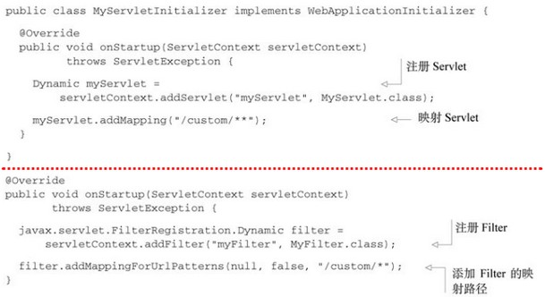

  - 若只是想将自定义的Filter映射到DispatcherServlet 上，实现AbstractAnnotationConfigDispatcherServletInitializer 中的getServletFilters() 方法即可

- web.xml中声明DispatcherServlet（相当于实现AbstractAnnotationConfigDispatcherServletInitializer 类）

  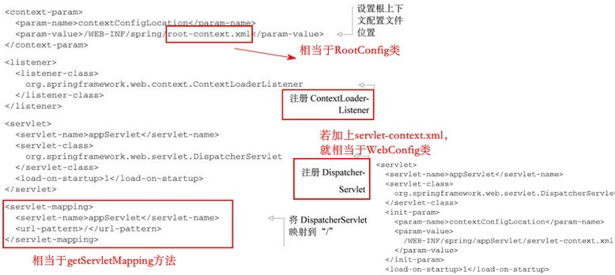

- 在web.xml中配置AnnotationConfigWebApplicationContext 类使用基于Java的Spring配置 

### 7.2 处理multipart形式的数据 

- 请求体

  - 没有二进制数据的一般请求体

    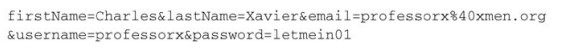
  - multipart的请求体 

    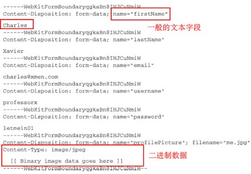

- multipart解析器 
  - 定义一个MultipartResolver 类型的bean，通常是StandardServletMultipartResolver 

    - 若是WebApplicationInitializer 方式初始化的DispatcherServlet 

      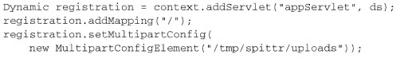

    - 若是继承AnnotationConfigDispatcherServletInitializer 初始化的DispatcherServlet ，可通过重载customizeRegistration()方法进行配置

      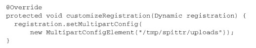

    - 若是xml，直接在DispatcherServlet 的servlet标签下进行multipart配置

    - MultipartConfigElement 还有其它参数，用于配置其它

  - CommonsMultipartResolver ，不常用，略

- 处理multipart请求 

  - `@RequestPart` 注解，类比于`@RequestParam`注解
  - 在控制器方法的参数中，可直接使用byte[]类型的参数，但较为原始不方便。MultipartFile 和Part 类型的参数提供API

### 7.3 处理异常 

Servlet请求在异常情况下的输出依然是Servlet响应，Spring有多种将异常转换为响应的方式：

- 特定的异常自动映射成HTTP状态码

  - 内置映射关系见书。如NoSuchRequestHandlingMethodException（没有对应的控制器处理），就对应的是404状态码

- 异常上添加`@ResponseStatus`注解 ，映射成为一个HTTP状态

  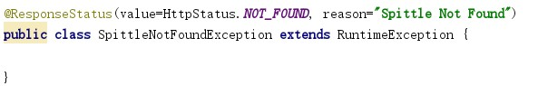

  - 没有进行手动映射的异常，默认都是对应500状态码

- 方法上添加`@ExceptionHandler`注解 ，处理异常

  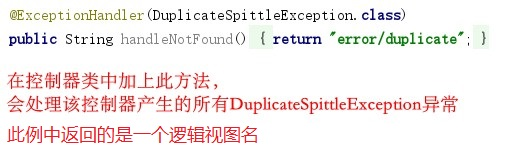

### 7.4 为控制器添加通知

在`@ExceptionHandler`注解中，作用域只是本控制器类，若需要对所有控制器类都加上此处理方法，每个类都手动添加则很不方便。于是就可运用AOP思想，为控制器添加通知

控制器通知是任意带有`@ControllerAdvice`注解的类， 包含：

- `@ExceptionHandler`注解标注的方法
- `@InitBinder`注解标注的方法
- `@ModelAttribute`注解标注的方法 

在带有`@ControllerAdvice`注解的类中， 以上所述的这些方法会运用到整个应用程序所
有控制器中带有`@RequestMapping`注解的方法上 

### 7.5 跨重定向请求传递数据

控制器方法中，若返回的String值以`redirect:`开头 ，那这个String不是用来查找视图的， 而是用来指导浏览器进行重定向的路径 

数据的流向：在控制器方法中加入数据至模型 --> 模型中的数据会被复制到请求中，作为属性 --> 请求被转发到视图上进行渲染。而在重定向中，两次请求是不同的，无法利用此方法进行数据传递

- 通过URL模板进行重定向 

  - 直接将变量写入重定向的URL

    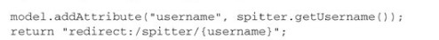

  - 没有显示指定在URL中的属性，会被自动以`?param=value`的形式加入重定向URL中

- 使用flash属性 

  - 若要将对象数据传递，就不能简单地放在URL中

  - 可以放在会话中，会话能长期存在

  - 也可以将数据发送为flash属性 ，flash属性会一直携带这些数据直到下一次请求 

    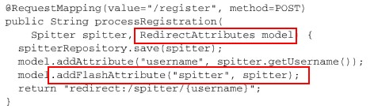

    - 所有的flash属性都会复制到会话中 

    - 重定向后， 存在会话中的flash属性会被取出， 并从会话转移到模型之中 

      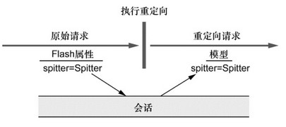

# 8. Spring Web Flow 

一个Web框架，是MVC的拓展，用的不多，略

# 9. 保护Web应用 

### 9.1 Spring Security

在Web请求级别和方法调用级别处理身份认证和授权，基于Filter实现的框架

- 模块

  - 至少要包含Core和Configuration这两个模块 

- 过滤Web请求

  - 只需要配置DelegatingFilterProxy ，Spring Security 会通过此类将处理逻辑委托给已注入的Filter（类似DispatcherServlet）

    

  - 可以用xml配置，也可以扩展AbstractSecurityWebApplicationInitializer 类来自动配置（类似DispatcherServlet）
  - DelegatingFilterProxy会拦截发往应用中的请求， 并将请求委托给ID为springSecurityFilterChain 的bean 

(...................) 框架应用，先搞懂Spring原理，等理解再来看应用

### 9.2 选择查询用户详细信息的服务 

### 9.3 拦截请求 

### 9.4 认证用户 

### 9.5 保护视图 

