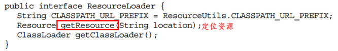
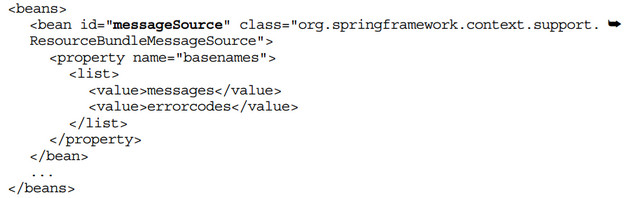

[TOC]

# 5. Spring IoC容器之ApplicationContext

继承自BeanFactory ，所以BeanFactory 的所有功能均支持，需要关注其特有的功能

### 5.1 统一资源加载策略 

java.net.URL所定义的定位器抽象能力不清晰，Spring提供Resource 和ResourceLoader 的资源抽象和加载策略

#### Spring中的Resource 

- 所有资源的抽象和访问接口，接口定义见书
- 一些实现类：
  - ByteArrayResource ：字节数组作为一种资源进行封装，通过InputStream 访问时，会返回ByteArrayInputStream 
  - ClassPathResource ：从ClassPath 中加载资源进行封装
  - FileSystemResource ：对java.io.File类型的封装 
  - UrlResource ：通过java.net.URL进行的具体资源查找定位的实现类 
  - InputStreamResource ：少用，一般ByteArrayResource 代替

#### ResourceLoader 

- 查找和定位资源

- 定义如下

  

- 一些实现类：

  - DefaultResourceLoader ，默认实现类：若路径以`classpath:`前缀 开头，则构造ClassPathResource类并返回；否则，尝试通过URL定位（如前缀为`file:`或`http:`或`ftp:`），返回UrlResource ；再否则，委派getResourceByPath(String) 方法进行定位（DefaultResourceLoader 该方法默认返回ClassPathResource资源，资源不存在时会返回一个不存在的资源）
  - FileSystemResourceLoader ：继承自DefaultResourceLoader ，覆盖了getResourceByPath方法，当资源无法通过ClassPathResource或URL定位时，不再返回ClassPathResource类型，而是返回FileSystemResource 类型

- ResourcePatternResolver （批量查找的ResourceLoader） ：

  - 可以根据指定的资源路径匹配模式，每次返回多个Resource实例 

    

  - 内部包含一个ResourceLoader （默认为DefaultResourceLoader ），将所有匹配的资源路径都交给此ResourceLoader 处理，只是返回数量不同

#### ApplicationContext与ResourceLoader 

- ApplicationContext也继承自ResourceLoader ,关系图如下：

  

  - ApplicationContext的实现类本身是一个ResourceLoader ，又将自己传入一个ResourcePatternResolver中，所以拥有了两者的功能

- 扮演ResourceLoader 的角色（getResource调用）

- ResourceLoader类型的注入 

  - 当一个bean需要ResourceLoader来获取资源时，可以在其构造方法或属性声明一个ResourceLoader，由Spring容器将其注入（此方法需要自己配置一个ResourceLoader到Spring容器）
  - 也可以通过实现ResourceLoaderAware和ApplicationContextAware接口来实现此功能（见4.4），不需要配置ResourceLoader

- Resource类型的注入 

  - ApplicationContext自动识别Resource，在注入时，不需要提供自定义的Resource类，直接在配置文件中以String形式指定资源的位置

    

  - 原理就是内部默认实现了一个针对Resource类型的PropertyEditor（ResourceEditor ）（见4.4），实现到String类型到Resource类型的转换

    

- 特定ApplicationContext 实现类的Resource加载行为

  

### 5.2 国际化信息支持

#### Java SE的国际化支持

- Locale

  

- ResourceBundle

  - 根据Locale取得ResourceBundle，然后再从ResourceBundle查询信息了

    

#### MessageSource与ApplicationContext 

- ApplicationContext 实现了MessageSource接口，默认情况下，ApplicationContext 将有关MessageSource的职责委派给容器中名为“messageSource “的MessageSource 类型的bean，所以一般有如下配置：

  
  
  

- MessageSource实现类：
  - StaticMessageSource ，容器中找不到MessageSource时默认使用，用于测试
  - ResourceBundleMessageSource ：ResourceBundle的扩展实现
  - ReloadableResourceBundleMessageSource ：以定期刷新并检查底层的properties资源文件是否有变更 

- MessageSourceAware和MessageSource的注入 
  - 类似其它，MessageSourceAware可将容器自身注入给bean，但侵入性强，对容器依赖性强
  - 一般是直接在对象里声明一个MessageSource属性，直接将上述名为“messageSource “的bean注入即可

### 5.3 容器内部事件发布 

- Java SE 的自定义事件实现一般结构为：

  

- Spring 的容器内事件发布类结构 
  
  - ApplicationListener 类型的bean会被容器自动识别，负责监听所有容器内发布的ApplicationEvent 事件，一旦有这些事件，ApplicationListener 就会对这些事件进行处理
  
  - ApplicationEvent ，抽象类，继承自EventObject ，实现类有：
  
    - ContextClosedEvent ：容器在即将关闭时发布的事件
    - ContextRefreshedEvent ：容器在初始化或者刷新的时候发布的事件
    - RequestHandledEvent ：Web请求处理后发布的事件，子类ServletRequestHandledEvent提供特定于Java EE的Servlet相关事件 
  
  - ApplicationListener ，继承自EventListener 
  
  - ApplicationContext ，可作为ApplicationEventPublisher 
  
    

- Spring 容器内事件发布的应用 
  - 用于单一容器内的简单消息通知和处理，并不适合分布式、多进程、多容器之间的事件通知
  - 类似其它，注入 ApplicationEventPublisher 可以用 ApplicationEventPublisherAware 或ApplicationContextAware 接口

### 5.4 多配置模块加载的简化 

# 6. Spring IoC容器扩展

### 6.1 基于注解的依赖注入

#### @Autowired

与原有的`default-autowire="byType"` 的自动绑定方式类似， @Autowired也是按照类型匹配进行依赖注入的，可用在域、构造方法和一般方法上，其逻辑伪代码如下（利用反射）：

BeanPostProcessor 的实现类 AutowiredAnnotationBeanPostProcessor 用来检查当前对象是否有@Autowired标注的依赖需要注入，需要配置在xml文件中

#### @Qualifier 

实际上是`default-autowire="byName"`自动绑定的注解版 ，可使用在域和参数上

`@Resource` 遵循的是byName自动绑定形式的行为准则 ，`@PostConstruct` ，`@PreDestroy` 分别相当于`init-method和destroy-method` 标签（或InitializingBean 和DisposableBean 接口 ），同样，使这些注解生效需要配置CommonAnnotationBeanPostProcessor 至xml文件中

直接将`<context:annotation-config/>`配置在文件中，会自动将有关于注解的BeanPostProcessor全部注册到容器中

`<context:component-scan base-package="path"/>` ，当扫描到某个类标注了相应的注解（`@Component 、@Repository、 @Service和@Controller` ）之后，就会提取该类的相关信息，构建对应的BeanDefinition，然后把构建完的BeanDefinition注册到容器 ，默认是使用类名的首字母小写来当bean的id名